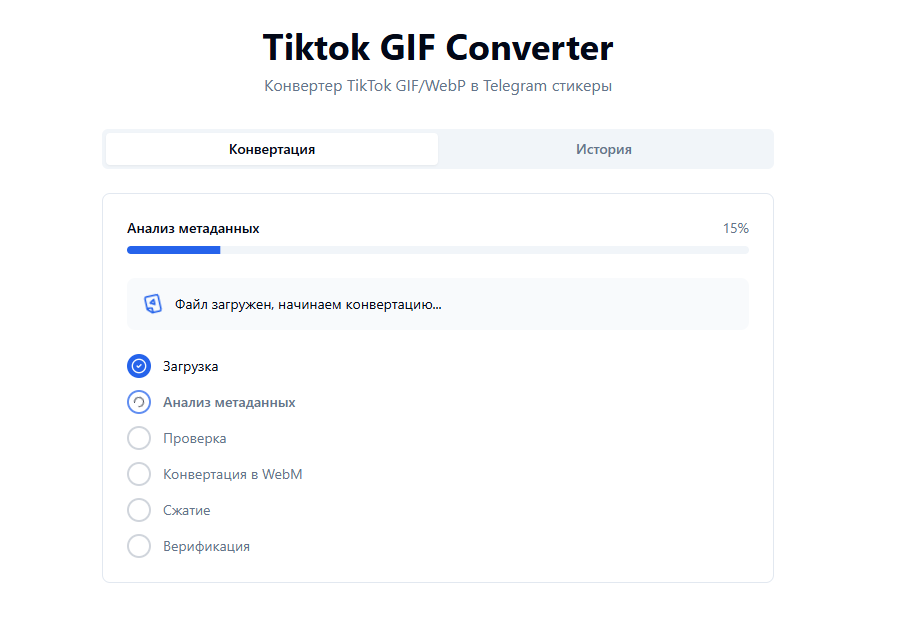
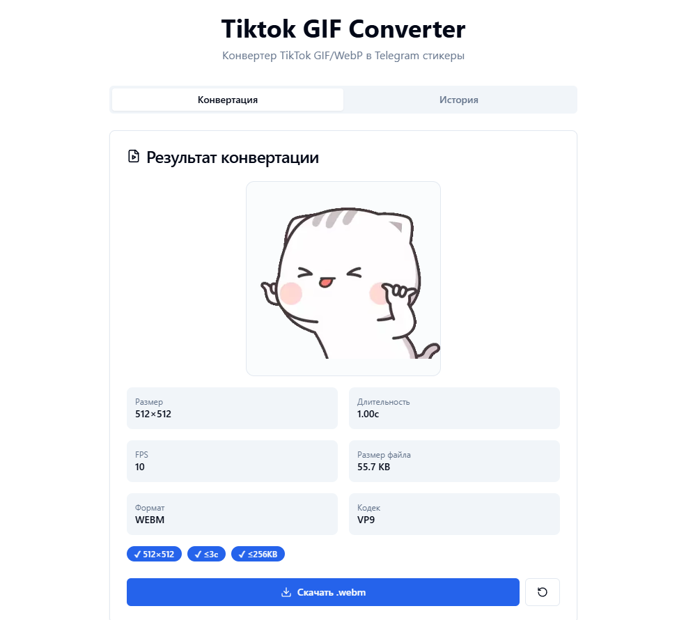

# ttgifconv

Конвертер анимированных `GIF` и `WebP` в Telegram-совместимые видео-стикеры `WEBM (VP9)`.

| | |
| --- | --- |
|  |  |

## Содержание

- [Что умеет](#что-умеет)
- [Техстек](#техстек)
- [Структура проекта](#структура-проекта)
- [Требования](#требования)
- [Быстрый старт](#быстрый-старт)
- [Переменные окружения](#переменные-окружения)
- [Доступные команды](#доступные-команды)
- [Как работает конвертация](#как-работает-конвертация)
- [API](#api)
- [История конвертаций](#история-конвертаций)
- [Тесты и проверка](#тесты-и-проверка)
- [Troubleshooting](#troubleshooting)

## Что умеет

- принимает `.gif` и анимированный `.webp`
- конвертирует в `.webm` с кодеком `VP9`
- приводит результат к точному размеру `512x512`
- ограничивает длительность до `3` секунд
- подбирает сжатие под лимит Telegram `256 KB`
- показывает preview результата и mini-preview в истории
- хранит историю локально в браузере через `IndexedDB`

## Техстек

- **Monorepo**: `pnpm workspaces`
- **Frontend**: React 18, Vite, TypeScript, Tailwind CSS, shadcn/ui
- **Backend**: Fastify, TypeScript, fluent-ffmpeg, sharp
- **Shared package**: общие типы и константы TypeScript
- **Storage**: client-side `IndexedDB` для истории

## Структура проекта

```text
.
├── backend/                 # Fastify API + конвертация через FFmpeg
│   └── src/
│       ├── app.ts           # сборка Fastify приложения
│       ├── index.ts         # entry point backend
│       ├── config/env.ts    # env-конфиг
│       ├── routes/          # upload / convert / download / health / history
│       ├── services/        # pipeline конвертации
│       ├── utils/ffmpeg.ts  # ffmpeg / ffprobe / sharp утилиты
│       └── tests/           # backend tests
├── frontend/                # React UI
│   └── src/
│       ├── App.tsx
│       ├── components/
│       ├── lib/api.ts
│       ├── lib/history-db.ts
│       └── tests/
├── shared/                  # @ttgifconv/shared
│   └── src/
│       ├── constants.ts
│       ├── index.ts
│       └── types/
├── outputs/                 # готовые .webm файлы
├── tmp/                     # временные файлы конвертации
├── package.json             # root workspace scripts
└── pnpm-workspace.yaml
```

## Требования

- `Node.js >= 18`
- `pnpm`
- установленный `FFmpeg` и `ffprobe` в `PATH`

### Установка FFmpeg

#### Windows

```bash
winget install Gyan.FFmpeg
```

или:

```bash
choco install ffmpeg
```

#### macOS

```bash
brew install ffmpeg
```

#### Ubuntu / Debian

```bash
sudo apt update
sudo apt install ffmpeg
```

Проверка:

```bash
ffmpeg -version
ffprobe -version
```

## Быстрый старт

### 1. Установка зависимостей

```bash
pnpm install
```

### 2. Создание `.env`

Создай файл `.env` в корне проекта:

```env
PORT=3001
HOST=127.0.0.1
MAX_FILE_SIZE=52428800
TMP_DIR=./tmp
OUTPUT_DIR=./outputs
DEFAULT_FPS=30
DEFAULT_BITRATE=500
MAX_COMPRESSION_PASSES=5
MIN_QUALITY=0.5
```

Если `.env` нет, backend все равно стартует с дефолтами из `backend/src/config/env.ts`.

### 3. Запуск разработки

```bash
pnpm dev
```

Это поднимет:

- frontend: `http://localhost:5173`
- backend: `http://127.0.0.1:3001`

### 4. Сборка

```bash
pnpm build
```

## Переменные окружения

Все переменные читаются в `backend/src/config/env.ts`.

| Переменная | Назначение | По умолчанию |
| --- | --- | --- |
| `PORT` | порт backend | `3001` |
| `HOST` | host backend | `127.0.0.1` |
| `MAX_FILE_SIZE` | лимит upload в байтах | `52428800` |
| `TMP_DIR` | временная директория | `./tmp` |
| `OUTPUT_DIR` | директория готовых файлов | `./outputs` |
| `DEFAULT_FPS` | верхний target fps | `30` |
| `DEFAULT_BITRATE` | стартовый bitrate в kbps | `500` |
| `MAX_COMPRESSION_PASSES` | максимум попыток сжатия | `5` |
| `MIN_QUALITY` | минимальный quality floor | `0.5` |

## Доступные команды

### Root

```bash
pnpm dev
pnpm build
pnpm test
pnpm lint
pnpm type-check
```

### Shared

```bash
pnpm --filter @ttgifconv/shared build
pnpm --filter @ttgifconv/shared type-check
```

### Backend

```bash
pnpm --filter @ttgifconv/backend dev
pnpm --filter @ttgifconv/backend build
pnpm --filter @ttgifconv/backend test
pnpm --filter @ttgifconv/backend type-check
```

### Frontend

```bash
pnpm --filter @ttgifconv/frontend dev
pnpm --filter @ttgifconv/frontend build
pnpm --filter @ttgifconv/frontend test
pnpm --filter @ttgifconv/frontend type-check
```

## Как работает конвертация

Pipeline находится в `backend/src/services/conversion.ts`.

1. **Upload** - файл сохраняется во временную директорию `tmp/`
2. **Inspect** - `ffprobe` / `sharp` читают метаданные
3. **Validate** - проверяется формат и анимированность WebP
4. **Resize** - результат принудительно приводится к `512x512`
5. **Trim** - длительность режется до `3` секунд
6. **Encode** - `ffmpeg` кодирует `webm` через `libvpx-vp9`
7. **Compress** - iterative compression пытается уложиться в `256 KB`
8. **Verify** - проверка финальных ограничений Telegram
9. **Store** - готовый файл перемещается в `outputs/`

### Ограничения Telegram

Определены в `shared/src/constants.ts`:

- размер: `512x512`
- длительность: `<= 3s`
- размер файла: `<= 256 KB`
- output format: `webm`
- output codec: `vp9`

## API

### `GET /api/health`

Проверка состояния backend и доступности FFmpeg.

### `POST /api/upload`

Multipart upload файла.

Возвращает:

```json
{
  "fileId": "uuid",
  "fileName": "example.gif",
  "fileSize": 12345,
  "mimeType": "image/gif"
}
```

### `POST /api/convert/:fileId`

Запускает конвертацию загруженного файла.

Возвращает:

```json
{
  "success": true,
  "fileId": "uuid",
  "downloadUrl": "/api/download/uuid",
  "metadata": {
    "width": 512,
    "height": 512,
    "duration": 2.1,
    "fps": 30,
    "fileSize": 152300,
    "format": "webm",
    "codec": "vp9"
  },
  "warnings": []
}
```

### `GET /api/download/:fileId`

Отдает готовый `.webm` как attachment.

### `GET /outputs/:fileId.webm`

Статическая раздача файлов из `outputs/`.

### `GET /api/history`

Сейчас это placeholder: основная история хранится на клиенте в браузере.

## История конвертаций

История хранится в `IndexedDB` через `frontend/src/lib/history-db.ts`.

Сохраняется:

- `originalName`
- `originalFormat`
- timestamp
- metadata результата
- warnings
- `outputBlob` для локального скачивания

Во вкладке истории доступны:

- mini-preview
- скачивание результата
- удаление записи
- повторное открытие результата

## Тесты и проверка

### Полная проверка

```bash
pnpm type-check
pnpm test
```

### Полезные targeted-команды

```bash
pnpm --filter @ttgifconv/backend test -- --run src/tests/conversion.test.ts
pnpm --filter @ttgifconv/backend test -- --run src/tests/animated-webp.test.ts
pnpm --filter @ttgifconv/frontend test -- --run src/components/ResultPanel.test.tsx
```

## Troubleshooting

### `FFmpeg is not available`

Проверь, что `ffmpeg` и `ffprobe` доступны в `PATH`:

```bash
ffmpeg -version
ffprobe -version
```

### Upload проходит, но конвертация падает

Проверь:

- файл действительно анимированный
- входной формат `.gif` или animated `.webp`
- в `tmp/` и `outputs/` есть права на запись

### Не открывается история

История клиентская и хранится в `IndexedDB`, поэтому:

- она привязана к конкретному браузеру
- очистка site data удалит историю
- в private/incognito режиме поведение может отличаться

### После rename не резолвятся workspace-пакеты

Обнови workspace links:

```bash
pnpm install
```

## Статус проекта

Сейчас это локальный monorepo-инструмент для конвертации TikTok-style анимаций в Telegram video stickers, без серверной БД и без server-side истории.

## Теги

`ttgifconv`, `telegram sticker converter`, `telegram video sticker converter`, `telegram webm sticker`, `telegram animated sticker converter`, `telegram sticker maker`, `telegram sticker tool`, `telegram sticker app`, `telegram webm converter`, `telegram vp9 sticker`, `telegram sticker encoder`, `telegram sticker generator`, `telegram sticker optimizer`, `telegram sticker resizer`, `telegram sticker compressor`, `telegram sticker preview`, `telegram sticker history`, `telegram sticker upload tool`, `telegram sticker workflow`, `telegram sticker format converter`, `video sticker telegram`, `webm sticker telegram`, `vp9 sticker telegram`, `telegram stickers webm`, `telegram video stickers`, `telegram animated stickers`, `create telegram sticker from gif`, `create telegram sticker from webp`, `gif to telegram sticker`, `gif to telegram webm`, `gif to webm`, `gif to vp9`, `gif to sticker`, `gif converter for telegram`, `gif sticker converter`, `gif webm converter`, `gif to animated sticker`, `convert gif to telegram sticker`, `convert gif to webm`, `convert gif to vp9`, `webp to telegram sticker`, `webp to telegram webm`, `webp to webm`, `webp to vp9`, `animated webp converter`, `animated webp to webm`, `animated webp to telegram sticker`, `convert webp to telegram sticker`, `convert webp to webm`, `convert webp to vp9`, `tiktok gif converter`, `tiktok webp converter`, `tiktok to telegram sticker`, `tiktok animation converter`, `tiktok sticker converter`, `tiktok asset to telegram`, `sticker converter`, `webm converter`, `vp9 converter`, `animation converter`, `animated image converter`, `gif compressor`, `webp compressor`, `webm optimizer`, `telegram ready webm`, `telegram compatible webm`, `telegram sticker dimensions 512x512`, `telegram sticker 512x512`, `512x512 webm`, `512x512 sticker converter`, `resize to 512x512`, `upscale to 512x512`, `downscale to 512x512`, `telegram sticker 256kb`, `compress to 256kb`, `video sticker 3 seconds`, `telegram sticker ffmpeg`, `ffmpeg telegram sticker`, `fastify sticker api`, `react sticker app`, `vite sticker converter`, `indexeddb conversion history`, `local sticker history`, `browser sticker history`, `конвертер gif в telegram sticker`, `конвертер webp в telegram sticker`, `конвертер gif в webm`, `конвертер webp в webm`, `конвертер в webm`, `конвертер в vp9`, `конвертер анимированных webp`, `конвертер анимаций в telegram`, `конвертер стикеров telegram`, `конвертер видео стикеров telegram`, `создать стикер telegram из gif`, `создать стикер telegram из webp`, `gif в telegram sticker`, `webp в telegram sticker`, `gif в webm`, `webp в webm`, `gif в vp9`, `webp в vp9`, `видео стикеры telegram`, `анимированные стикеры telegram`, `telegram стикеры webm`, `telegram webm стикеры`, `telegram sticker webm`, `утилита для telegram stickers`, `приложение для telegram stickers`, `инструмент для конвертации стикеров`, `сжатие под telegram sticker`, `ресайз до 512x512`, `апскейл до 512x512`, `даунскейл до 512x512`, `telegram sticker 256 кб`, `стикер telegram 3 секунды`, `конвертер тикток анимаций`, `конвертер tiktok gif`, `локальная история конвертаций`, `история конвертаций indexeddb`
